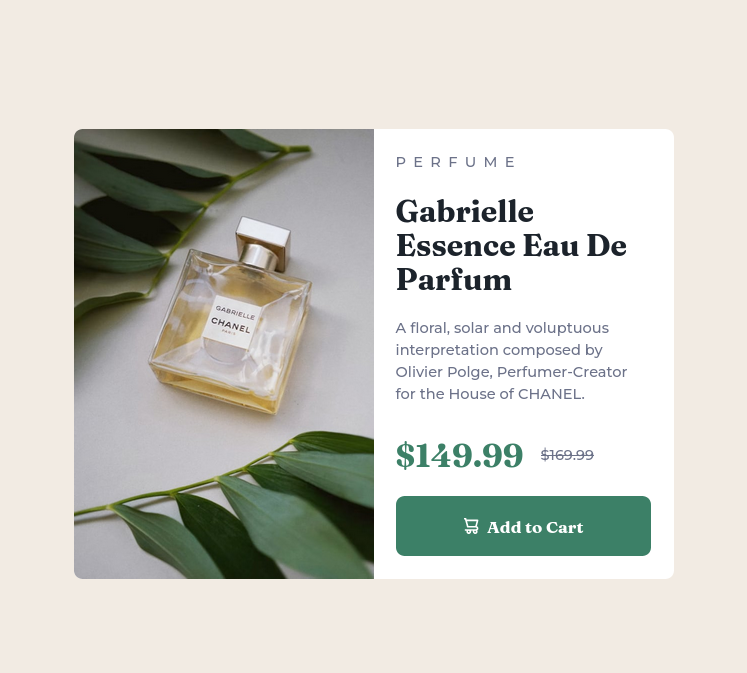
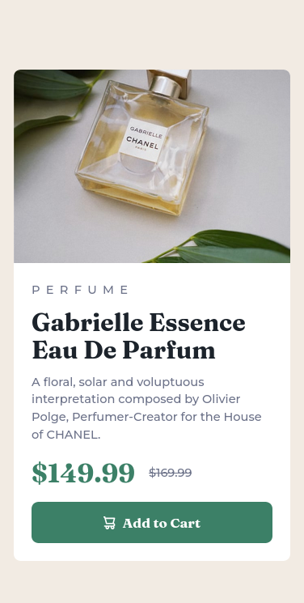

# Frontend Mentor - Product preview card component solution

This is a solution to the [Product preview card component challenge on Frontend Mentor](https://www.frontendmentor.io/challenges/product-preview-card-component-GO7UmttRfa).

### The challenge

Users are be able to:

- View the optimal layout depending on their device's screen size
- See hover and focus states for interactive elements

### Screenshot

Desktop

Mobile


### Links

- Solution URL: [Add solution URL here](https://your-solution-url.com)
- Live Site URL: [Add live site URL here](https://your-live-site-url.com)

## My process

Started with structuring my HTML page then moved on to styling my CSS

### Built with

- Semantic HTML5 markup
- CSS custom properties
- Flexbox
- CSS Grid
- Mobile-first workflow

### What I learned

Best practices when it comes to CSS and thinking throughly before-hand so that everything is neat and organized e.g (using the root element to set all the properties). This saved me a lot of time and it was also easier, faster to find and modify things when i needed it.

Using pre-coded CSS Reset to counteract any problems that would arise.

Using the proper tags where they're needed. This also made me learn, that I can set the medie query property inside the HTML picture tag using the <source> tag.

Refreshed my Memory about flex and grid layouts.

```html
<picture class="card-image">
  <source
    srcset="./images/image-product-desktop.jpg"
    media="(min-width:600px)" />
  
</picture>
```

```css
/* Kinda Everything */
```

### Continued development

Revisit CSS layouts(flex and grid) and the rem and em unit.

### Useful resources

- [Example resource 1](https://www.youtube.com/watch?v=B2WL6KkqhLQ&t=9s) - This helped me remember a lot of forgotten things. I really liked this person's channel and will use it going forward.

## Author

- Frontend Mentor - [@Amani-dot](https://www.frontendmentor.io/profile/Amani-dot)
- Twitter - [@Amani-dot](https://twitter.com/Amani_Off)

## Acknowledgments

Shout out to kevin powell.........that's it.
